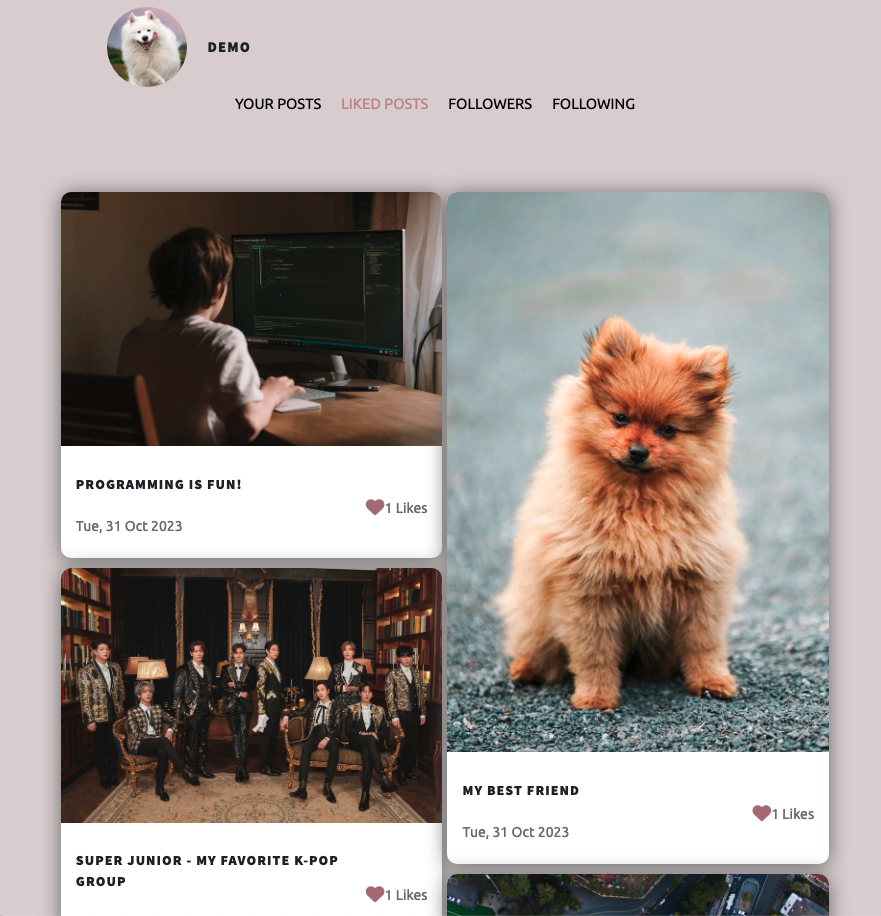
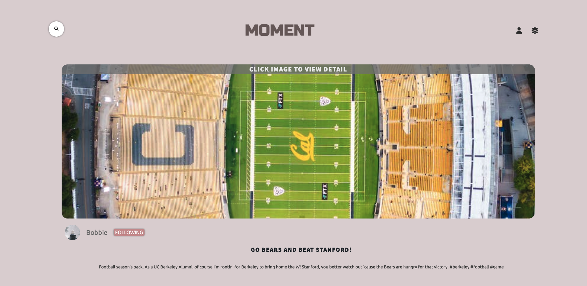

# MeetFriends


## Project Summary
This project aims to create a social media platform that allows people to establish connections with others and showcase their most cherished life experiences and moments within the community.

## Wiki Link

## Link to Live Site

https://moment-2igd.onrender.com/


## Contact the Project Owner
linkedin.com/in/yi-c-452811132
## Technologies Used

Frameworks, Platforms, and Libraries
> React

> Redux/Redux-thunk

> HTML 5

> CSS

> Javascript

> JSX

> Flask

> SQLAlchemy

Database
> Development: SQLite3

> Production: PostgreSQL

Hosting:
> Render.com


## Table of Contents
- Getting Started

- Project Demo
  - Project Features

      >Landing Page

      >Sign Up/ Log In/ Log Out

      >Posts

            1.See All Posts and post details
            2.See A User's Posts
            3.Create A New Post with Image Upload via AWS S3 Bucket 
            4.Update A Post with Image Update via AWS S3 Bucket 
            5.Delete A Post

      >Comments
            
            1.See All Post Comments
            2.Create A New Comment on A Post with Image Upload via AWS S3 Bucket
            3.Update A Comment on A Post with Image Update via AWS S3 Bucket 
            4.Delete A Comment

      >Search

            Search For A Post By Username, Post Content, and Comment

      >Liking
            
            1.Like A Post
            2.Remove Like On A Post
            3.View All Posts Liked By User
            4.View Total Likes Of A Post

      >Following
            
            1.Follow A User
            2.Remove Followed Users
            3.Remove Followers
            4.View Followed Users
            5.View Followers


- Upcoming Features
   >Google Map

   >Recommendations

   >Hash Tags
      
- Frontend Redux Store Shape
   ````bash
      {
         users:{
            singleUser: {
               ...state.singleUser,
               likedPosts: {
                  ...state.singleUser.likedPosts,
                  [action.postId]: null
               },
               userPosts: {
                  ...state.singleUser.userPosts,
                  
                  [action.postId]: {
                  ...state.singleUser.userPosts[action.postId],
                  likeUsers: {
                     ...state.singleUser.userPosts[action.postId]?.likeUsers,
                     [action.userId]: null
                  },
               
                  },
               
               }

            }
         },
         comments:{
            comments: {
               ...state.comments,
               [action.commentId]: {
                  ...state.comments[action.commentId],
                  commentImages:[action.commentImage]
               }
            },
            singleComment: {
               ...state.singleComment,
               commentImages:action.commentImages
            }
         }
      }


## Getting Started


* Start the project locally

  - Clone github repo to you local directory
    - git clone https://github.com/heehyun1128/API-project.git

*  Install dependencies

      >pipenv install -r requirements.txt

*  Create a .env file based on the example with proper settings for your development environment

*  Make sure the SQLite3 database connection URL is in the .env file
*  Get into your pipenv, migrate your database, seed your database, and run your Flask app

   ````bash
   cd app
   pipenv shell
   flask db upgrade
   flask seed all
   flask run


*  Start the project frontend
    - cd to frontend directory and run npm start
      ````bash
      cd react-app
      npm start
    - the project will be running locally at http://localhost:3000/
      

## Features

* Landing Page

Before a user is signed up/logged in, the user can only view all posts, all comments, and total likes of a post. The Create A Post button, My Page button and Like button are disabled for users not signed up or logged in.

After a user is signed up and logged in, the user can create a post, update a post, delete a post, create comments on a post, update a comment, and delete a comment they created. A user can also like and unlike a post and follow and unfollow a user.


* Sign Up/ Log In/ Log Out

Click on the Sign Up button on the Landing Page or the All Posts Page to create a user. A Demo User is created for testing purposes.


* View All Posts

The user can view all posts by clicking on the VIEW ALL POSTS button in the top right dropdown menu.


* View Post Details

The user can view details of a post by clicking on the post in the all posts page.


* View All Comments


* Create A Post

A user can click on the CREATE A POST button in the dropdown menu in the navigation bar to navigate to the create post form page. A user will be able to upload images for their post.


Create Post Form Page


* Update A Post

Click on the EDIT POST button on the post detail page to update a post.

A user who is logged-in but does not own the group OR is not logged-in will not be albe to update the group. A user will be able to update images for their post.


* Delete a Post

Clicking the Delete button on a group's details page will open a confirmation modal popup window that ask the user to confirm removing or keeping the group.


* Create a Comment

A user who's logged in and is the post creator will be able to create a comment for the post. A user who's not logged in or is not the post creator will not be able to create a comment and will be prompt to log in. A user will be able to upload an image for their comment.


* Update a Comment

A user can update a comment including comment image they created.


* Delete a Comment

A user who is the post creator can delete a comment for a post.


* Search for a Post

A user can search for a particular post using the search bar and view the search result.


* Liking

A user can like or unlike a post by clicking on the heart icon.


A user can like their own posts on the user posts page on My Page.


A user can also view all their liked posts on My Page.



* Following

A user can follow or unfollow a user by clicking on the FOLLOW or FOLLOWING buttons on the post detail page. A user can also do so by clicking the REMOVE FOLLOWER or UNFOLLOW buttons on My Page under FOLLOWERS and FOLLOWING tabs.





A user can also view their followers and followed users on My Page by clicking on the FOLLOWERS and FOLLOWING tabs.


## Upcoming Features


* Google Map
* Recommendations
* Hash Tags


